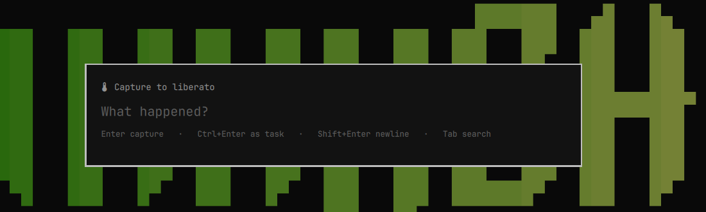

# Capacities for Omarchy

**A thought, a key, Enter — it's in today's daily note. Or ask the space a
question and land in the object.**

One overlay with two modes. Capture is the one you reach for without thinking:
whatever you type is appended to today's daily note in Capacities, under the
timestamp it stamps itself. Search asks the same surface a question instead —
type, Enter, pick, and the desktop app opens on that object.

Capturing and organizing are separate moments. This owns the capture.

## Install

    omarchy plugin add <this repo> --enable

Then connect it to a space. Generate a token in the Capacities desktop app
(**Settings → Capacities API → Generate new token**, read *and* write), then:

    omarchy-capacities login --token cap-api-…

A token is bound to one space, which is how this knows where captures go.

On first load the plugin writes `~/.config/omarchy-capacities/config.json`,
puts `omarchy-capacities` on your PATH, and adds a **Capacities** section to
the Omarchy menu under *Trigger*. It takes no keybinding — a key is yours to
give:

    capacities-bind-key                        # SUPER+N captures, SUPER+SHIFT+N searches
    capacities-bind-key "SUPER + J" "SUPER + K"

Or write it yourself in `~/.config/hypr/bindings.lua`:

    o.bind("SUPER + N", "Capture", "omarchy-shell shell toggle riclib.capacities '{}'")
    o.bind("SUPER + SHIFT + N", "Search", "omarchy-shell riclib.capacities search")

## Usage

| Key | Capture mode | Search mode |
| --- | --- | --- |
| type | compose the thought | compose the query |
| <kbd>Enter</kbd> | append to the daily note, close | search — then open the picked object |
| <kbd>Ctrl</kbd>+<kbd>Enter</kbd> | append as `- [ ]` task | — |
| <kbd>Shift</kbd>+<kbd>Enter</kbd> | new line, same capture | — |
| <kbd>↑</kbd> <kbd>↓</kbd> | — | walk the results (wraps) |
| <kbd>Tab</kbd> | switch to search | switch to capture |
| <kbd>Esc</kbd> | clear, then close | drop results, then clear, then close |

Click outside the card to close without saving.

In search mode <kbd>Enter</kbd> searches while the query has moved on since the
last one, and opens what you picked once it hasn't — so the key does the
obvious thing at speed rather than needing you to track a mode.

## The bar

The plugin also puts a lightbulb on the bar, for the days you have not learned
the key yet.

| Click | What opens |
| --- | --- |
| left | the panel — today, open tasks, recent |
| middle | the capture overlay |
| right | the search overlay |

While a capture is stuck in the outbox the icon wears the urgent colour and the
count beside it. That is the one thing only the bar can say — the overlay is
only on screen while you are typing into it.

### The panel

- **Today** — the last few lines of today's daily note. Clicking one opens the
  note *at that line*, using a block-level deep link.
- **Open tasks** — tasks with no completion date, soonest first.
- **Recent** — recently created objects, newest first.
- Buttons for capture, search, and sync; <kbd>c</kbd>, <kbd>s</kbd>,
  <kbd>r</kbd> do the same, <kbd>t</kbd> opens today's note, <kbd>Esc</kbd>
  closes.

Opening the panel is what syncs it, and only if the cache is more than two
minutes old — so a second monitor's panel doesn't repeat the refresh the first
one just did. Nothing polls in the background.

**Recent needs a creation time.** The API reports one only for types that carry
the *Created at* property, and it is not on custom types by default — the panel
names the ones it had to skip. Add *Created at* to a type in Capacities and it
starts appearing.

**Recent warms up.** List responses carry no timestamps and no ordering, so a
creation time costs one read per object, capped per sync to stay inside the
quota. The first syncs show the objects it has read so far, not the true newest.
`omarchy-capacities sync --backfill 20` spends more in one go.

## From a terminal

    omarchy-capacities capture "the thought"      # → today's daily note
    omarchy-capacities capture --task "do it"     # → as a checkbox
    omarchy-capacities link                       # clipboard URL → a Weblink object
    omarchy-capacities link https://example.com --note "why this matters"
    omarchy-capacities search solid               # → JSON, what the overlay parses
    omarchy-capacities open <object-id>           # → capacities:// deep link
    omarchy-capacities status                     # token, space, queue depth
    omarchy-capacities sync                       # refresh what the panel shows
    omarchy-capacities sync --backfill 20         # warm Recent faster
    omarchy-capacities drain                      # retry what the queue holds

## A capture is never lost

If the API can't be reached — no network, or a 429, or a 5xx — the capture goes
to `~/.local/state/omarchy/capacities/outbox.json` and a toast says so. The next
capture drains it first, or `omarchy-capacities drain` does it by hand; the
overlay's footer shows the depth while anything is waiting. A request the API
*rejected* is not queued, because replaying it just gets rejected again.

## Configuration

`~/.config/omarchy-capacities/config.json`:

    {
      "template": "- {text}",
      "taskTemplate": "- [ ] {text}",
      "searchLimit": 12,
      "openIn": "app",
      "todayBullets": 8,
      "taskLimit": 8,
      "recentLimit": 8,
      "recentStructures": ["Page", "Idea", "Meeting", "Project"],
      "syncTaskDetails": 10,
      "syncRecentDetails": 8
    }

`template` is the markdown a capture becomes. `{text}` is what you typed;
everything else goes through `strftime`, so `"- %H:%M {text}"` works.

Captures land as plain bullets. Put the clock back with
`"template": "- %H:%M {text}"` if you want one.

`openIn` is `app` or `web` — whether a picked result opens in the desktop app
(`capacities://…`) or the browser.

The `sync*` numbers are how many object reads one panel refresh may spend.
Raising them fills Recent and task state faster and eats more of the
thirty-requests-per-minute quota; `recentStructures` names the types Recent
considers, and any of them without a *Created at* property is skipped.

## Where things live

    Capture.qml      the overlay: both modes, the key handling, the result list
    BarSlot.qml      the bar icon, the queued badge, and the panel it hosts
    Panel.qml        today / open tasks / recent, and the actions
    PanelRow.qml     one clickable line
    Model.js         parsing and index arithmetic — plain JS, tested with node
    bin/omarchy-capacities   the API client: token, outbox, structure cache
    bin/capacities-setup     first-load setup — config, menu rows, PATH
    bin/capacities-bind-key  the shortcut, when you ask for it

### The daily-note endpoint

Captures are appended to today's daily note object with `POST /blocks/append`,
not with Capacities' dedicated `POST /blocks/daily-note/append`.

The dedicated endpoint is documented as asynchronous, and on 2026-08-21 that
meant answering `200` with an empty body and delivering many minutes later —
long enough that four probes looked lost, across two different days, in the
same minutes that `/blocks/append` to an ordinary object landed and read back
immediately. They did eventually arrive. A capture tool cannot use a write it
cannot confirm: the outbox exists to hold what did not arrive, and it can only
do that if arrival is knowable. So this resolves the day's note by title
(cached per day) and appends to it like any other object, which is immediate
and verifiable. If the dedicated endpoint gets a delivery guarantee, the
resolve step is what to delete.

A day whose note does not exist yet is queued rather than dropped: Capacities
creates the note when the app opens the day, and the queued capture lands then.

The QML never talks to the API. The token belongs in a 0600 file rather than in
the shell's process state, a failed capture belongs in a queue on disk, and the
space's structure list wants a cache so a search doesn't spend one of its
ten-per-minute space reads relabelling rows. All three are ordinary in Python
and miserable in QML.

## Rate limits

Capacities' quotas are small and per-endpoint: 10/60s for space reads, 30/60s
for search and daily-note appends. Nothing here polls. Searches run on
<kbd>Enter</kbd>, never per keystroke, and the structure list is cached for 12
hours.

## Tests

    node --test tests/model.test.js    # parsing, wrapping selection, ages, elision
    tests/cli.test.sh                  # the offline queue, token file mode

Both run without a network or a token.

## License

MIT
